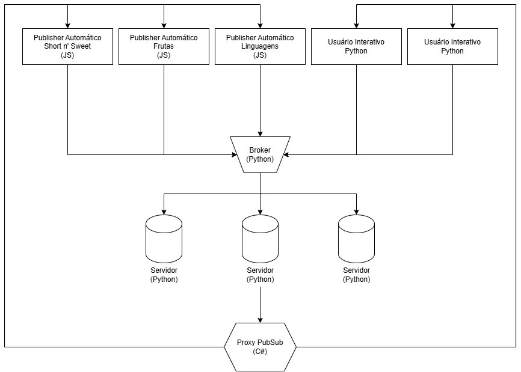

# 📄 Documentação do Projeto — Rede Social Assíncrona com Pub/Sub

## 👥 Integrantes

Livia Lumi Miyabara – 22.122.045-2 <br>
Márcio Forner Nepomuceno Almeida – 22.122.040-3 <br>
Thiago Garcia Santana – 22.122.003-1 <br>

## 🧩 Funcionalidades da Aplicação

Esta aplicação simula uma **rede social distribuída**, onde usuários e bots podem:

- **Publicar mensagens públicas**.
- **Seguir/deixar de seguir outros usuários**.
- **Enviar mensagens privadas**.
- **Visualizar histórico de posts e mensagens privadas**.
- **Sincronizar ou ajustar o relógio do cliente**.

Bots automáticos publicam mensagens a cada 5 segundos sobre:
- 🍌 Frutas
- 🎵 Músicas da Sabrina Carpenter
- 💻 Linguagens de programação

---

## 🔁 Troca de Informações

- **Request-Reply (REQ/REP)**  
  Utilizado entre clientes e servidores para requisições como login, publicações, mensagens privadas e sincronização de tempo.

- **Publish-Subscribe (PUB/SUB)**  
  Utilizado para envio assíncrono de notificações públicas ou privadas em tempo real para os clientes que seguem um determinado usuário.

---

## 🚀 Como Testar a Aplicação

### ✅ Pré-requisitos

- [Docker](https://www.docker.com/)  
- [Python 3.x](https://www.python.org/) com:
  - `pyzmq`
  - `msgpack`
  - `redis`
- [Node.js](https://nodejs.org/) com:
  - `zeromq`
  - `msgpack-lite`
- [.NET 6 SDK](https://dotnet.microsoft.com/) com suporte a C# (para o proxy)
- Git (opcional, para clonar o repositório)

---

### 📥 Clonando o Repositório

```bash
git clone https://github.com/itslumiya/rede-social
cd rede-social
```

### ⚠️ Atenção ao Caminho no .bat
O script start.bat contém caminhos fixos como: `C:\Users\user\Desktop\rede-social\...`

#### 🔧 Você deve atualizar os caminhos no .bat para refletirem o local real do projeto em sua máquina.
Exemplo:

```bat
start cmd /k dotnet run --project "C:\SEU_CAMINHO\rede-social\ProxyPubSub\ProxyPubSub.csproj"
```
🔧 Você deve atualizar os caminhos no .bat para refletirem o local real do projeto em sua máquina.
Exemplo:

```bat
start cmd /k dotnet run --project "C:\SEU_CAMINHO\rede-social\ProxyPubSub\ProxyPubSub.csproj"
```

### ▶️ Execução
1. Abra o terminal no diretório do projeto.
2. Execute o ExecuteProject.bat (Clique duas vezes no arquivo, ou `ExecuteProject.bat` no terminal)
3. O script irá:
    * Subir ou iniciar um container Redis
    * Iniciar o Proxy (C#)
    * Iniciar o Broker (Python)
    * Iniciar 3 instâncias do `Server.py` (você escolhe o número de servidor manualmente)
    * Iniciar os bots automáticos
    * Iniciar dois terminais com `InteractiveUser.py` para uso manual

### 🧪 Testes e Interação
Nos terminais com `InteractiveUser.py`, você pode:
* Publicar mensagens
* Seguir e parar de seguir usuários
* Enviar mensagens privadas
* Ver publicações e chats
* Ajustar o relógio (simular inconsistência de tempo)
* Sincronizar o tempo com o servidor

### 🧼 Finalizando
Ao pressionar qualquer tecla no terminal principal (do .bat):
* O Redis será esvaziado com `FLUSHALL`
* O container será parado e removido
* Todos os logs ficam salvos em:
```bash
Logs/
├── Clients/
└── Servers/
```
### 📦 Estrutura dos Componentes

